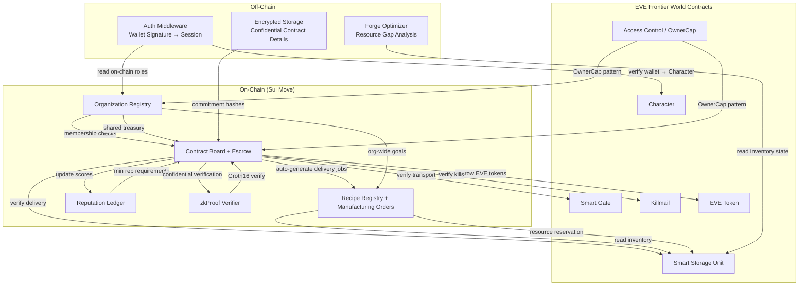
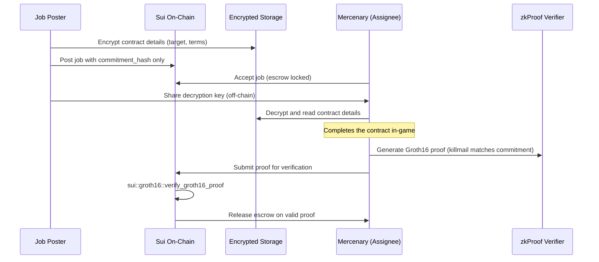

# Frontier Forge — A Toolkit for Civilization

## EVE Frontier × Sui Hackathon 2026

**Theme:** "A Toolkit for Civilization"
**Timeline:** March 11–31, 2026 (~20 days)
**Approach:** Hybrid on-chain/off-chain with heavy Sui Move architecture

---

## Thesis

Civilization requires **division of labor**, and division of labor requires **trust infrastructure**. Frontier Forge provides that trust layer on Sui — a connected suite of tools that let players organize, coordinate work, plan manufacturing, and build reputation, all composable on-chain.

---

## Architecture Overview



---

## Modules

### Phase 1 — Foundation (Days 1–4): Organization Registry

**On-chain Move package.**

The auth primitive everything else depends on.

- `Organization` shared object
  - name, leader (Character ID)
  - membership `Table<ID, Role>`
  - Roles: `Leader`, `Officer`, `Member`
- `OrgCap` — capability issued to members, scoped to org functions
- Org-level shared treasury (holds EVE tokens via `assets/EVE.move`)
- On-chain voting for treasury spend (configurable threshold)

**Sui showcase:** Object model — each org is a first-class object with its own membership table, treasury, and governance. Composes naturally with the world contracts `OwnerCap` pattern.

**Key files in world-contracts:**
- `contracts/world/sources/access/access_control.move` — OwnerCap, AdminACL patterns
- `contracts/world/sources/character/character.move` — Character identity, tribe_id, character_address
- `contracts/extension_examples/sources/config.move` — ExtensionConfig + AdminCap + dynamic field pattern

---

### Phase 2 — Contract Board (Days 5–10): Job Board + Escrow

**On-chain Move package + off-chain encrypted storage.**

#### On-Chain

- `JobPosting` shared object
  - `poster_id` (Character ID)
  - `reward_type_id`, `reward_quantity`
  - `escrow` (EVE tokens locked on creation)
  - `completion_type` enum
  - `assignee` (optional Character ID)
  - `deadline` (timestamp)
  - `status` enum: `Open`, `Assigned`, `Completed`, `Disputed`, `Expired`
- `JobEscrow` — wraps EVE tokens or items, released on verified completion

#### Completion Verification Types

Leveraging existing world contract events/objects:

| Type | On-Chain Verification |
|------|----------------------|
| **Delivery** | `ItemDepositedEvent` at specified StorageUnit — character deposited X quantity of type_id Y |
| **Bounty/Kill** | `KillmailCreatedEvent` matching target victim_id |
| **Transport** | `JumpEvent` for specific character through specified gate |
| **Custom/Confidential** | Groth16 zkProof (see below) |

#### Confidential Contracts (Mercenary Use Case)

- **On-chain:** stores only `commitment_hash = hash(target, reward, deadline, nonce)`
- **Off-chain:** encrypted contract details, shared only with accepted assignee
- **Completion:** assignee submits Groth16 zkProof proving:
  *"I know a killmail where victim matches the committed target and killer matches my character"*
  — without revealing the target publicly
- **Sui native:** `sui::groth16::verify_groth16_proof`

**Sui showcase:** Escrow via object ownership, event-driven verification, native zkProof verification, composability with world contract Killmail/Inventory/Gate events.

**Key files in world-contracts:**
- `contracts/world/sources/killmail/killmail.move` — KillmailCreatedEvent, victim_id, killer_id
- `contracts/world/sources/primitives/inventory.move` — ItemDepositedEvent, ItemWithdrawnEvent, type_id/quantity
- `contracts/world/sources/assemblies/gate.move` — JumpEvent, JumpPermit pattern
- `contracts/world/sources/assemblies/storage_unit.move` — extension-based deposit/withdraw
- `contracts/extension_examples/sources/corpse_gate_bounty.move` — reference for combining storage + gate extensions
- `contracts/assets/sources/EVE.move` — EVE token for escrow

---

### Phase 3 — Forge Planner (Days 11–16): Manufacturing Planner

**On-chain registry + off-chain optimization engine.**

#### On-Chain

- `RecipeRegistry` shared object
  - `Table<u64, Recipe>` mapping output `type_id` → input requirements `vector<{type_id, quantity}>`
  - Admin-managed (org leaders can propose recipes)
- `ManufacturingOrder` shared object
  - Target item (`type_id`, `quantity`)
  - Required inputs (from recipe resolution)
  - Allocated resources / status
  - Linked org ID
- Resource reservation via StorageUnit extension pattern
  - Withdraw → hold in order escrow → deposit on completion or return on cancellation

#### Off-Chain Optimizer

- Reads inventory state from StorageUnit on-chain (items by `type_id` and `quantity`)
- Given a build goal, recursively resolves the recipe tree
- Computes: what you have → what's missing → what needs to be gathered
- Outputs a shopping list / gathering plan
- **Auto-generates Delivery job postings** on the Contract Board for missing resources

**Sui showcase:** Dynamic fields for recipe storage, composability between ManufacturingOrder → JobPosting → StorageUnit.

**Key files in world-contracts:**
- `contracts/world/sources/primitives/inventory.move` — Inventory struct, ItemEntry (type_id, quantity, volume)
- `contracts/world/sources/assemblies/storage_unit.move` — inventory view functions, extension-based access

---

### Phase 4 — Reputation & Polish (Days 17–20)

#### Reputation Ledger (On-Chain)

- `ReputationRegistry` shared object
  - `Table<ID, ReputationScore>` keyed by Character ID
- Auto-updated on job completion:
  - Successful completion → +rep
  - Abandonment/expiry → -rep
- Queryable on-chain by any module or external tool
- Optional: Organization-level aggregate reputation

#### Cross-Module Integration Polish

- Org → Job Board: only org members can post from org treasury
- Job Board → Forge Planner: missing resources auto-generate delivery contracts
- Job Board → Reputation: completed jobs update scores
- Reputation → Job Board: high-value contracts require minimum rep
- Org → Forge Planner: org-wide manufacturing goals using shared inventory

---

## Privacy Architecture



- **On-chain:** commitment hashes only (content hash + nonce)
- **Off-chain:** AES-encrypted blobs (IPFS or lightweight backend)
- **Key exchange:** between parties using wallet-derived keys
- **Verification:** Groth16 proofs verified natively on Sui

---

## Technical Stack

| Layer | Technology |
|-------|-----------|
| Smart Contracts | Sui Move |
| zkProofs | Groth16 via `sui::groth16` |
| Off-chain Auth | Wallet signature verification → session tokens |
| External Tools | TypeScript/React web app |
| Data Layer | Sui RPC for on-chain reads, encrypted off-chain storage |
| World Integration | EVE Frontier World Contracts (typed witness extension pattern) |

---

## Hackathon Category Targets

| Category | Alignment |
|----------|-----------|
| **Utility** | Manufacturing planner + job board directly change how players coordinate and survive |
| **Technical Implementation** | Heavy Sui usage: Move packages, escrow, zkProofs, composable extensions |
| **Creative** | Connected "G-Suite" concept with privacy layer is novel for Frontier |
| **Live Frontier Integration** | Org system + job board deployable to Stillness for real player testing |

---

## Submission Deliverables

- [ ] Demo video (max 6 minutes)
- [ ] 200-word description
- [ ] Git repository with source code
- [ ] Supporting documentation / architecture diagrams
- [ ] (Stretch) Live deployment to Stillness

---

## Repository Structure (Planned)

```
hackathon/
├── plan.md                          # This file
├── world-contracts/                 # Reference: EVE Frontier world contracts (cloned)
├── contracts/                       # Our Sui Move packages
│   ├── organization/                # Phase 1: Org registry + treasury + voting
│   │   ├── Move.toml
│   │   ├── sources/
│   │   └── tests/
│   ├── contract_board/              # Phase 2: Job board + escrow + verification
│   │   ├── Move.toml
│   │   ├── sources/
│   │   └── tests/
│   ├── forge_planner/               # Phase 3: Recipe registry + manufacturing orders
│   │   ├── Move.toml
│   │   ├── sources/
│   │   └── tests/
│   └── reputation/                  # Phase 4: Reputation ledger
│       ├── Move.toml
│       ├── sources/
│       └── tests/
├── app/                             # Off-chain web application
│   ├── src/
│   │   ├── auth/                    # Wallet signature auth middleware
│   │   ├── optimizer/               # Manufacturing planner optimizer
│   │   ├── privacy/                 # Encrypted storage + key exchange
│   │   └── ui/                      # Dashboard / planning interface
│   └── package.json
├── circuits/                        # zkProof circuits (Groth16)
│   └── confidential_contract/
└── scripts/                         # Deployment and testing scripts
```
